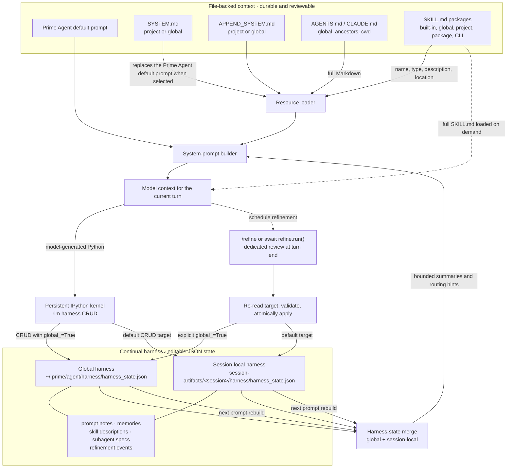

# Prompt Context and Continual Harness Architecture

This document explains how Prime Agent combines file-backed Markdown context (the "outer" harness) with the editable continual harness. It describes durable architecture rather than the contents of any one session.

## System Overview



## The Two Persistence Layers

| Layer | Best use | Storage and loading | Change mechanism |
|---|---|---|---|
| File-backed Markdown | Stable project rules, safety constraints, commands, architecture, and packaged workflows | Version-controlled project files or user configuration; loaded as resources | Normal file review and commits |
| Continual harness | Evidence-backed facts, preferences, reusable procedures, delegation patterns, and active-session state | JSON ledger; compact summaries are injected into the prompt | `rlm.harness` CRUD, `/refine`, or `await refine.run()` |

The continual harness supplements the prompt. It does not rewrite the base prompt, edit `AGENTS.md`, or turn a stored skill description into executable code.

## File-Backed Context

### System prompt files

- Project `.prime/agent/SYSTEM.md` takes priority over global `~/.prime/agent/SYSTEM.md` and replaces Prime Agent's default prompt body.
- Project `.prime/agent/APPEND_SYSTEM.md` takes priority over global `~/.prime/agent/APPEND_SYSTEM.md` and appends text to the assembled prompt.
- Platform and host safety constraints remain outside this project-level replacement mechanism.

### Project context files

Prime Agent loads one `AGENTS.md` or `CLAUDE.md` per discovered directory, preferring `AGENTS.md`. The order is:

1. `~/.prime/agent/AGENTS.md`
2. ancestor directories from filesystem root toward the working directory
3. the current working directory

Their full contents enter the `Project Context` section. Use these files for explicit, reviewable rules rather than transient state. `--no-context-files` disables their discovery.

### Skills

Installed skills are filesystem packages centered on `SKILL.md`. At prompt construction, Prime Agent injects only routing metadata: name, type, description, and location. The model reads the complete `SKILL.md` only when the task matches or the user invokes the skill. Python-backed skills additionally install callable code into the persistent kernel.

A continual-harness `skill` entry is different: it is a reusable Python-call description with `reference` and `arguments` metadata. It does not install a package or replace `SKILL.md`.

## Continual Harness Scopes

### Session-local state

Default CRUD and refinement operations target:

```text
~/.prime/agent/session-artifacts/<root-session-id>/harness/harness_state.json
```

Use local state for active task progress, temporary blockers, current-run coordination, and project facts that have not earned cross-session scope. It follows the root session and is available after compaction or session restoration, but unrelated new sessions do not inherit it.

### Global state

Explicit `global_=True` operations target:

```text
~/.prime/agent/harness/harness_state.json
```

Use global state only for stable cross-session lessons, durable user preferences, reusable skills or subagent patterns, and clearly project-qualified facts. Global refinement rollback history is stored alongside the global harness.

### Merge behavior

On prompt construction, Prime Agent loads global state and then session-local state. Both remain visible. If a local entry reuses a global entry ID, it is namespaced as a local entry instead of silently overwriting the global entry. Refinement history is combined, with session records winning only when the same refinement event ID conflicts.

The injected `Continual Harness State` section is intentionally compact and bounded. It is a routing menu, not the full ledger; code can inspect the complete entry through `rlm.get_harness_state()` or `rlm.harness`.

## Refinement Lifecycle

1. Work produces evidence: a correction, repeated failure, reusable tactic, durable fact, or repeated delegation pattern.
2. The model schedules `await refine.run(...)`, the user runs `/refine`, or code uses direct `rlm.harness` CRUD.
3. A dedicated refinement pass reviews the recent trajectory, current state, and refinement history.
4. Before applying its proposal, the host re-reads the target store so concurrent kernel or session writes are not clobbered.
5. Small create, update, or delete edits are written atomically and recorded with before/after evidence for rollback.
6. The next prompt build merges global and local state and injects updated compact summaries.

`await refine.run()` returns immediately and schedules the review for the end of the current turn. Direct `rlm.harness` CRUD updates the ledger immediately.

## Selection Guide

- Put non-negotiable project rules and validation commands in `AGENTS.md`.
- Put a specialized, distributable workflow in `SKILL.md`; use a Python-backed skill when it needs executable kernel functionality.
- Put stable architecture in an evergreen repository document and link it from `AGENTS.md` or a skill when the model must consult it.
- Put current-session progress or a temporary workaround in the local harness.
- Promote a lesson to the global harness only after it is stable, reusable across sessions, and sufficiently qualified to avoid affecting unrelated projects.
- Do not duplicate the same rule across every layer. Keep one authoritative source and use the other layers as routing hints.

## Implementation References

- [`resource-loader.ts`](../packages/coding-agent/src/core/resource-loader.ts) discovers context files, system prompt files, and skill resources.
- [`system-prompt.ts`](../packages/coding-agent/src/core/system-prompt.ts) assembles the model-facing prompt.
- [`refinement.ts`](../packages/coding-agent/src/core/refinement/refinement.ts) defines harness storage, merging, prompt summaries, refinement, and rollback.
- [`rlm-runtime.md`](../packages/coding-agent/docs/rlm-runtime.md) documents the kernel, recursive-agent runtime, and session artifact layout.
- [`skills.md`](../packages/coding-agent/docs/skills.md) documents installed Markdown and Python-backed skills.

## Current Session Example

The v0.7.5 release memory created during release work lives in the session-local harness file, not in repository Markdown and not in the global harness. Its compact title appears in subsequent prompt builds for this session; its full release evidence remains in the JSON ledger. This document, by contrast, is an evergreen, version-controlled explanation shared by every future checkout and session that reads the repository documentation.
